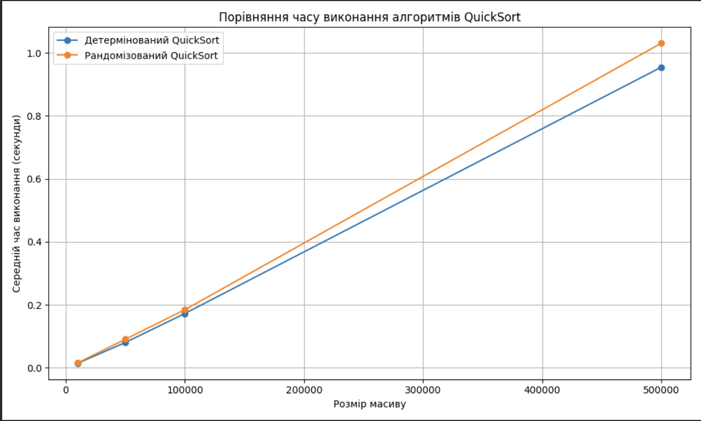

# goit-algo2-hw-10

Design and Analysis of Algorithms

Master of degree from University

## Завдання 1
### Результат обчислень
```
Розмір масиву: 10000
Детермінований QuickSort: середній час 0.0147 секунд
Рандомізований QuickSort: середній час 0.0158 секунд

Розмір масиву: 50000
Детермінований QuickSort: середній час 0.0805 секунд
Рандомізований QuickSort: середній час 0.0907 секунд

Розмір масиву: 100000
Детермінований QuickSort: середній час 0.1726 секунд
Рандомізований QuickSort: середній час 0.1846 секунд

Розмір масиву: 500000
Детермінований QuickSort: середній час 0.9546 секунд
Рандомізований QuickSort: середній час 1.0307 секунд
```


## Завдання 2
### Результат обчислень
```
Розклад занять:
Василь Ігоревич, 35 років, email: v.igori4@example.com
   Викладає предмети: Математика, Інформатика

Олексій Тулько, 50 років, email: o.tulkoko@example.com
   Викладає предмети: Біологія

Олеся Петрівна, 29 років, email: o.petrivna@example.com
   Викладає предмети: Географія, Історія

Олег Пушко, 35 років, email: o.pushko@example.com
   Викладає предмети: Фізика

Люся Хімікашко, 42 років, email: l.chimikashko@example.com
   Викладає предмети: Хімія
```